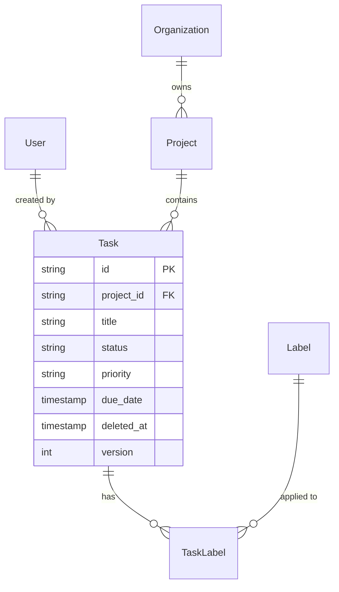

# Database Schema Designer

## Overview

Design relational database schemas from requirements and generate migrations, TypeScript/Python types, seed data, RLS policies, indexes, and ERD diagrams. Handles multi-tenancy, soft deletes, audit trails, versioning, and polymorphic associations.

## Activation

When the user asks to create ERD diagrams, normalize database schemas, design table relationships, or plan schema migrations.

## Core Capabilities

- **Schema design** — normalize requirements into tables, relationships, constraints
- **Migration generation** — Drizzle, Prisma, TypeORM, Alembic
- **Type generation** — TypeScript interfaces, Python dataclasses/Pydantic models
- **RLS policies** — Row-Level Security for multi-tenant apps
- **Index strategy** — composite indexes, partial indexes, covering indexes
- **Seed data** — realistic test data generation
- **ERD generation** — Mermaid diagram from schema

## Schema Design Process

### Step 1: Requirements to Entities

Given requirements, extract entities. Example:
> "Users can create projects. Each project has tasks. Tasks can have labels."

Extract: `User, Project, Task, Label, TaskLabel (junction)`

### Step 2: Identify Relationships

```
User 1──* Project         (owner)
Project 1──* Task
Task *──* Label            (via TaskLabel)
```

### Step 3: Add Cross-cutting Concerns

- **Multi-tenancy**: add `organization_id` to all tenant-scoped tables
- **Soft deletes**: add `deleted_at TIMESTAMPTZ` instead of hard deletes
- **Audit trail**: add `created_by`, `updated_by`, `created_at`, `updated_at`
- **Versioning**: add `version INTEGER` for optimistic locking

## Row-Level Security (RLS)

```sql
-- Enable RLS
ALTER TABLE tasks ENABLE ROW LEVEL SECURITY;

-- Users can only see tasks in their organization's projects
CREATE POLICY tasks_org_isolation ON tasks
  FOR ALL TO app_user
  USING (
    project_id IN (
      SELECT p.id FROM projects p
      JOIN organization_members om ON om.organization_id = p.organization_id
      WHERE om.user_id = current_setting('app.current_user_id')::text
    )
  );

-- Soft delete: never show deleted records
CREATE POLICY tasks_no_deleted ON tasks
  FOR SELECT TO app_user
  USING (deleted_at IS NULL);
```

## ERD Generation (Mermaid)



## Index Strategy

### Composite Indexes
```sql
-- For queries: WHERE org_id = ? AND status = ?
CREATE INDEX idx_tasks_org_status ON tasks(organization_id, status);
```

### Partial Indexes
```sql
-- Only index active records (soft delete aware)
CREATE INDEX idx_tasks_active ON tasks(project_id, status)
  WHERE deleted_at IS NULL;
```

### Covering Indexes
```sql
-- Include columns to avoid table lookups
CREATE INDEX idx_tasks_list ON tasks(project_id, status)
  INCLUDE (title, priority, due_date);
```

## Common Pitfalls

- **Soft delete without index** — `WHERE deleted_at IS NULL` without index = full scan
- **Missing composite indexes** — `WHERE org_id = ? AND status = ?` needs a composite index
- **Mutable surrogate keys** — never use email or slug as PK; use UUID/CUID
- **Non-nullable without default** — adding NOT NULL to existing table requires default or migration plan
- **No optimistic locking** — concurrent updates overwrite each other; add `version` column
- **RLS not tested** — always test RLS with a non-superuser role

## Best Practices

1. **Timestamps everywhere** — `created_at`, `updated_at` on every table
2. **Soft deletes for auditable data** — `deleted_at` instead of DELETE
3. **Audit log for compliance** — log before/after JSON for regulated domains
4. **UUIDs or CUIDs as PKs** — avoid sequential integer leakage
5. **Index foreign keys** — every FK column should have an index
6. **Partial indexes** — use `WHERE deleted_at IS NULL` for active-only queries
7. **RLS over application-level filtering** — database enforces tenancy, not just app code
